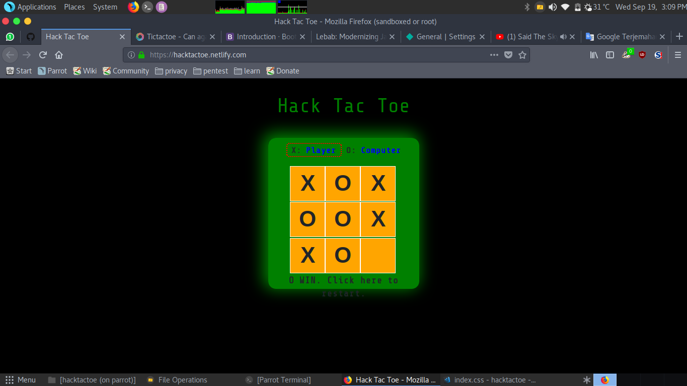
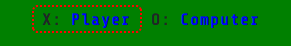

# Hack Tac Toe 


Hack Tac Toe is a tictactoe game with minor improvement. You can play with others players or just having fun with computer (fun if you win, LOL :v)

## Interface



Click here if you want to change opponent!! , you can play with your friend or just againts COM



I dont have signup section for now, but here's registered credetials that you can use for login:
```json
 {
     "username":"foobar",
     "password":"foobar123"
 },
 {
     "username":"tachonacho",
     "password":"tachonacho123"
 }
```

<center>
<h1>OR</h1>
Visit this repository for more details about <a href='https://github.com/ariebrainware/hacktactoe-api'>Back-end section</a> including <b>API Design</b>
</center>

## Feature 

1. 3 x 3 main board
2. Player vs Player
3. Player vs Computer
4. Scorebox
5. Login and Logout Mechanism 

## Upcoming Feature

1. Player name
2. Logging System
3. Multiplayer Online

### Devnote

Who is rob0ne?
*Note: If you just wonder, because i'm using Parrot OS Home edition. It has sandboxed built-in mechanism. Thats why in my commit. 'rob0ne' has commit in my repo*